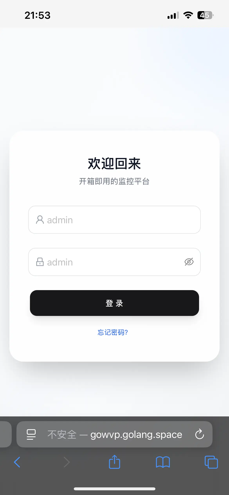
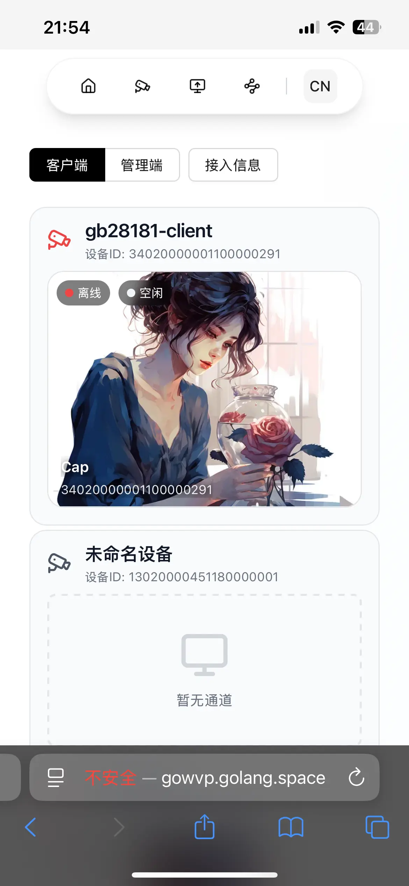

<p align="center">
    
</p>

<p align="center">
    <a href="https://github.com/gowvp/gb28181/releases"></a>
    <!-- <a href="https://github.com/ixugo/goddd/blob/master/LICENSE.txt"></a> -->
</p>

# 开箱即用的 GB/T28181 协议视频平台

go wvp 是 Go 语言实现的开源 GB28181 解决方案，基于 GB28181-2022 标准实现的网络视频平台，同时支持 2016/2011 版本，支持 rtmp/rtsp，客户端支持网页版本和安卓 App。

## 在线演示平台

+ [在线演示平台 :)](http://wvp.golang.space:15123/)


||||
|-|-|-|


## 应用场景：
+ 支持浏览器无插件播放摄像头视频。
+ 支持国标设备(摄像机、平台、NVR等)设备接入
+ 支持非国标(rtsp, rtmp，直播设备等等)设备接入，充分利旧。
+ 支持跨网视频预览。
+ 支持 Docker, Docker Compose, Kubernetes 部署


## 开源库

感谢 @panjjo 大佬的开源库 [panjjo/gosip](https://github.com/panjjo/gosip)，GoWVP 的 sip 信令基于此库，出于底层封装需要，并非直接 go mod 依赖该项目，而是源代码放到了 pkg 包中。

流媒体服务基于@夏楚 [ZLMediaKit](https://github.com/ZLMediaKit/ZLMediaKit)

播放器使用@dexter [jessibuca](https://github.com/langhuihui/jessibuca/tree/v3)

项目框架基于 @ixugo [goddd](https://github.com/ixugo/goddd)

## QA

> 怎么没有前端资源? 如何加载网页呢?

[点击前往下载 www.zip 压缩包](https://github.com/gowvp/gb28181_web/releases/latest)

前端资源下载(打包)后放到项目根目录，命名为 `www` 即可正常加载。

> 有没有代码相关的学习资料?

[GB/T28181 开源日记[1]：从 0 到实现 GB28181 协议的完整实践](https://juejin.cn/post/7456722441395568651)

[GB/T28181 开源日记[2]：搭建服务端，解决跨域，接口联调](https://juejin.cn/post/7456796962120417314)

[GB/T28181 开源日记[3]：使用 React 组件构建监控数据面板](https://juejin.cn/post/7457228085826764834)

[GB/T28181 开源日记[4]：使用 ESlint 辅助开发](https://juejin.cn/post/7461539078111789108)

[GB/T28181 开源日记[5]：使用 react-hook-form 完成表单](https://juejin.cn/post/7461899974198181922)

[GB/T28181 开源日记[6]：React 快速接入 jessibuca.js 播放器](https://juejin.cn/post/7462229773982351410)

[GB/T28181 开源日记[7]：实现 RTMP 鉴权与播放](https://juejin.cn/post/7463504223177261119)

[GB/T28181 开源日记[8]：国标开发速知速会](https://juejin.cn/post/7468626309699338294)

> 有没有使用资料?

**RTMP**

[RTMP 推拉流规则](https://juejin.cn/post/7463124448540934194)

[如何使用 OBS RTMP 推流到 GB/T28181平台](https://juejin.cn/post/7463350947100786739)

[海康摄像机 RTMP 推流到开源 GB/T28181 平台](https://juejin.cn/post/7468191617020313652)

[大华摄像机 RTMP 推流到开源 GB/T28181 平台](https://juejin.cn/spost/7468194672773021731)

**GB/T28181**

[GB28181 七种注册姿势](https://juejin.cn/post/7465274924899532838)

## 文档

GoWVP [在线接口文档](https://apifox.com/apidoc/shared-7b67c918-5f72-4f64-b71d-0593d7427b93)

ZLM使用文档 [github.com/ZLMediaKit/ZLMediaKit](https://github.com/ZLMediaKit/ZLMediaKit)

// >>>>>>>>>>>>>>>>>>>>>>>>>>>>>>>
<h1>看到这里啦，恭喜你发现新项目</h1>
<h1>点个 star 不迷路</h1>
// >>>>>>>>>>>>>>>>>>>>>>>>>>>>>>>


## Docker

### 视频指南

[如何构建或运行项目](https://www.bilibili.com/video/BV1QLQeYHEXb)

[如何用 docker compose 部署项目](https://www.bilibili.com/video/BV112QYY3EZX)


[docker hub](https://hub.docker.com/r/gospace/gowvp)


** gowvp & zlmediakit 融合镜像(推荐)**
docker-compose.yml
```yml
services:
  gowvp:
    # 如果拉不到 docker hub 镜像，也可以尝试
    # registry.cn-shanghai.aliyuncs.com/ixugo/homenvr:latest
    image: gospace/gowvp:latest
    restart: unless-stopped
    # linux 解开下行注释，并将 ports 全部注释
    # network_mode: host
    ports:
      # gb28181
      - 15123:15123 # 管理平台 http 端口
      - 15060:15060 # gb28181 sip tcp 端口
      - 15060:15060/udp # gb28181 sip udp 端口
      # zlm
      - 1935:1935 # rtmp
      - 554:554 # rtsp
      - 8080:80 # http
      - 8443:443 # https
      - 10000:10000
      - 8000:8000/udp
      - 9000:9000/udp
      - 20000-20100:20000-20100 # gb28181 收流端口
      - 20000-20100:20000-20100/udp # gb28181 收流端口udp
    volumes:
      # 日志目录是 configs/logs
      - ./data:/opt/media/bin/configs
```

** gowvp & zlmediakit 分离镜像(部署更复杂)**
```yml
services:
  gowvp:
    image: registry.cn-shanghai.aliyuncs.com/ixugo/gowvp:latest
    ports:
      - 15123:15123 # 管理平台 http 端口
      - 15060:15060 # gb28181 sip tcp 端口
      - 15060:15060/udp # gb28181 sip udp 端口
    volumes:
      # - ./logs:/app/logs # 如果需要持久化日志，请取消注释
      - ./configs:/app/configs
    depends_on:
      - zlm
  zlm:
    image: zlmediakit/zlmediakit:master
    restart: always
    # 推荐 linux 主机使用 host 模式
    # network_mode: host
    ports:
      - 1935:1935 # rtmp
      - 554:554 # rtsp
      - 8080:80 # api
      - 8443:443
      - 10000:10000
      - 10000:10000/udp
      - 8000:8000/udp
      - 9000:9000/udp
      - 20000-20100:20000-20100
      - 20000-20100:20000-20100/udp
    volumes:
      - ./configs:/opt/media/conf
```


## 快速开始

如果你是 Go 语言开发者并熟悉 docker，可以下载源代码，本地编程运行。

**前置条件**

+ Golang
+ Docker & Docker Compose
+ Make

**操作流程**

+ 1. 克隆本项目
+ 2. 修改 configs/config.toml 中 `WebHookIP` 为你的局域网 IP
+ 3. 执行 `make build/linux && docker compose up -d`
+ 4. 自动创建了 zlm.conf 文件夹，获取 config.ini 的 api 秘钥，填写到 `configs/config.toml` 的 `Secret`
+ 5. 执行 `docker compose restart`
+ 6. 浏览器访问 `http://localhost:15123`


##  如何参与开发?

1. fork 本项目
2. 编辑器 run/debug 设置配置输出目录为项目根目录
3. 修改，提交 PR，说明修改内容

## 功能特性

- [x] 开箱即用，支持 web
- [x] 支持 rtmp 流分发
- [x] 支持 rtsp 流分发
- [x] 支持输出 HTTP_FLV,Websocket_FLV,HLS,WebRTC,RTSP、RTMP 等多种协议流地址
- [x] 支持局域网/互联网/多层 NAT/特殊网络环境部署
- [x] 支持 SQLite 数据库快速部署
- [x] 支持 PostgreSQL/MySQL 数据库
- [x] 服务重启自动离线/自动尝试连接
- [x] GB/T 28181
  - [x] 设备注册，支持 7 种接入方式
  - [x] 支持 UDP 和 TCP 两种国标信令传输模式
  - [x] 设备校时
  - [x] 支持信息查询
    - [x] 设备目录查询
    - [x] 设备信息查询
    - [x] 设备基础配置查询(例如设备侧填写超时 3 秒，次数 3 次，则 9+x 秒左右收不到心跳认为离线，x 是检测间隔周期)
  - [x] 设备实时直播
  - [x] 支持 UDP 和 TCP 被动两种国标流传输模式
  - [x] 按需拉流，节省流量 (30秒无人观看自动停止)
  - [x] 视频支持播放 H264 和 H265
  - [x] 音频支持 g711a/g711u/aac
  - [x] 快照
  - [x] 支持跨域
  - [ ] 设备云台控制
  - [ ] 录像回放
  - [ ] 报警事件订阅
  - [ ] 报警事件通知处理


## 感谢

感谢赞助，排名不分先后。

[@joestarzxh](https://github.com/joestarzxh)
[@oldweipro](https://github.com/oldweipro)
[@beixiaocai](https://github.com/beixiaocai)


## 许可证

本项目采用 **[GNU 通用公共许可证 v3.0 (GPL-3.0)](https://www.gnu.org/licenses/gpl-3.0.html)** 授权。
  - **您可以自由使用、修改和分发本项目的代码**，但必须遵循以下条件：
  - **开源要求**：任何基于本项目的衍生作品（包括修改后的代码或集成本项目的软件）**必须同样以 GPL-3.0 协议开源**。
  - **保留协议与版权声明**：在衍生作品中需包含原项目的 `LICENSE` 文件及原始版权声明。
  - **明确修改说明**：若您修改了代码，需在文件中注明变更内容。

⚠ **注意**：若将本项目用于商业闭源软件或 SaaS 服务，需遵守 GPL-3.0 的传染性条款（即相关代码必须开源）。

完整许可证文本请见 [LICENSE](./LICENSE) 文件。